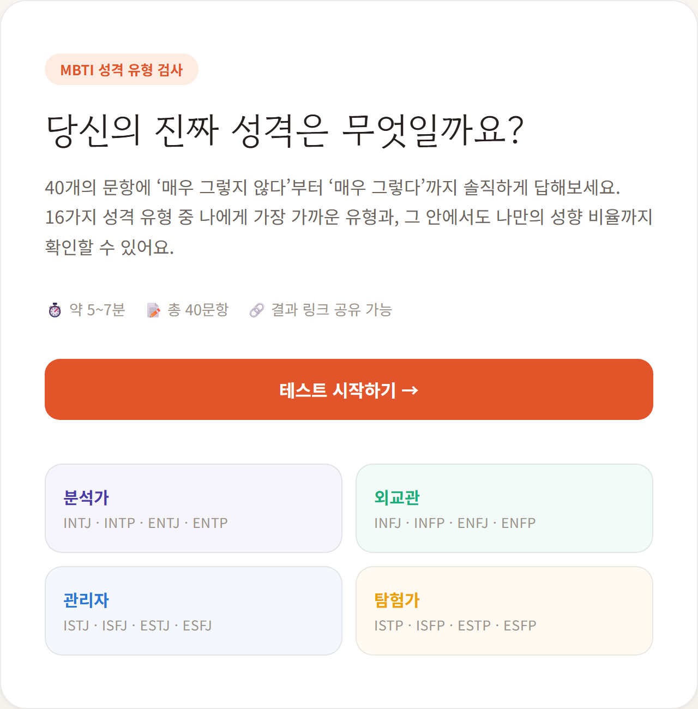
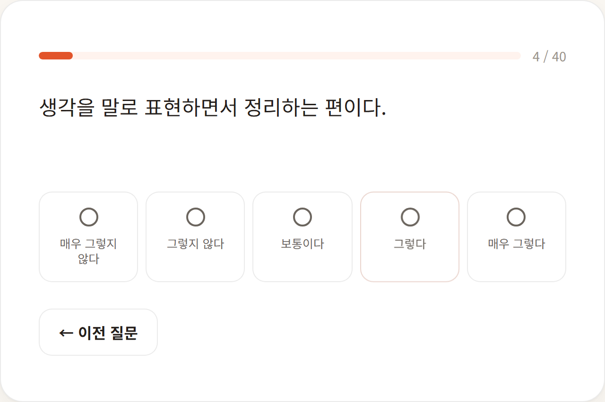
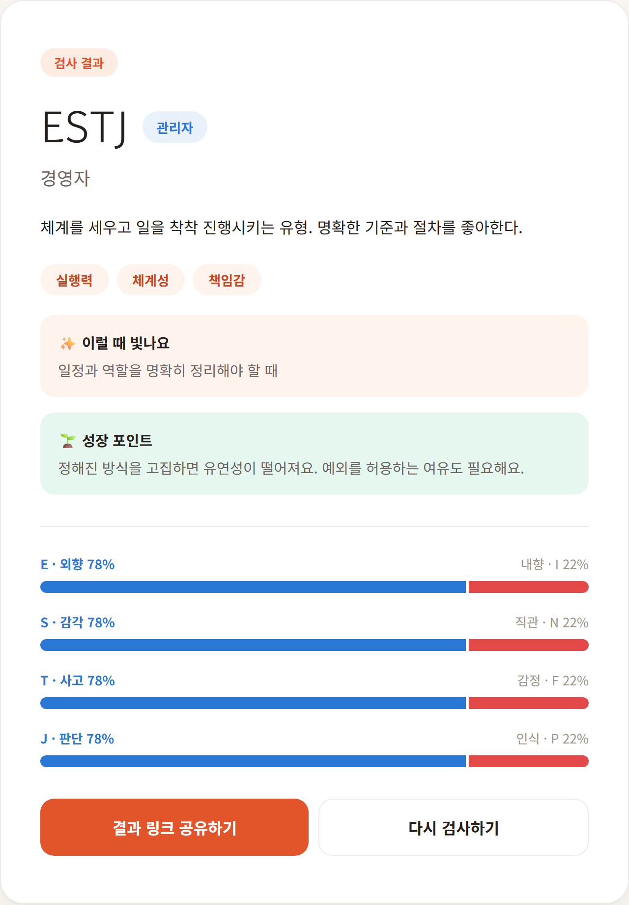
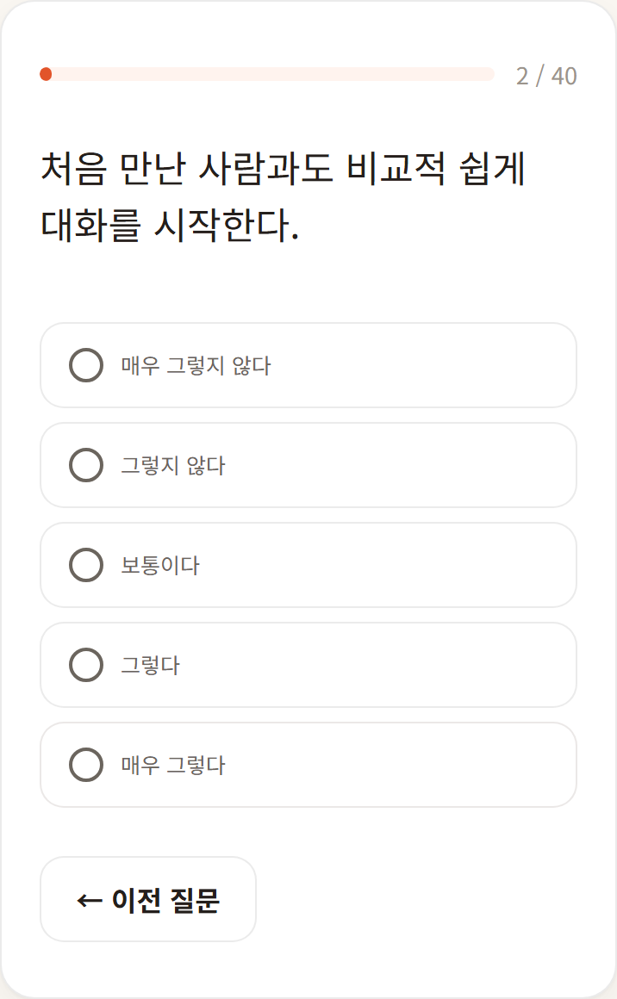

# MBTI 성격 유형 검사

**🔗 Live Demo: [mbti-test-smoky.vercel.app](https://mbti-test-smoky.vercel.app)**

40문항 5점 리커트 척도(매우 그렇지 않다 ~ 매우 그렇다)로 클래식 MBTI 16유형을 진단하는 웹 서비스입니다. 서버도 DB도 없이, 검사 결과를 URL에 그대로 담아서 링크 하나만 보내면 로그인 없이도 친구가 똑같은 결과 화면을 볼 수 있습니다.

기획부터 문항 설계, 프론트엔드 구현, UI 디자인까지 혼자 진행한 프로젝트입니다.



## 주요 기능

- **40문항 리커트 척도 검사** — 4개 축(E/I, S/N, T/F, J/P)마다 10문항, 각 축을 한쪽 극으로 치우친 진술 5개 + 반대쪽 극 진술 5개로 균형 있게 설계해 묵인 편향(acquiescence bias)을 줄였습니다.
- **뒤로가기 지원** — 이전 질문으로 돌아가 답변을 수정할 수 있고, 진행률 바에도 즉시 반영됩니다.
- **네이티브 공유 시트 연동** — 모바일에서 "결과 공유하기"를 누르면 Web Share API로 OS 공유 시트가 뜨고, 카카오톡·인스타그램 등 설치된 앱으로 바로 공유됩니다. 지원하지 않는 환경(주로 데스크톱)에서는 클립보드 복사로 자동 대체됩니다.
- **URL 기반 결과 공유** — 유형과 축별 성향 퍼센트를 쿼리스트링에 인코딩해서 `/result` 링크 자체가 결과의 전부입니다. DB 없이도 링크를 복사해 보내면 받는 사람이 동일한 결과를 그대로 봅니다.
- **16유형별 상세 리포트** — 유형 설명, 강점 태그, 성장 포인트, "이럴 때 빛나요"까지 유형마다 따로 작성했습니다.
- **기질 그룹 시각화** — 분석가·외교관·관리자·탐험가 4개 그룹을 색상 배지로 구분해 표시합니다.
- **유형별 동적 OG 이미지** — 카카오톡·트위터 등에 결과 링크를 붙여넣으면 유형 코드·닉네임·그룹 색상이 들어간 미리보기 카드가 그 자리에서 생성됩니다.
- **완전 무료 구조** — 외부 API·서버·DB 없이 프론트엔드만으로 동작해서 운영 비용이 들지 않습니다.

## 스크린샷

| 질문 화면 | 결과 화면 |
|---|---|
|  |  |

| 모바일 화면 |
|---|
|  |

## 기술 스택

**Frontend** — Next.js 16(App Router) · React 19 · TypeScript

**Infra** — Vercel (배포 · GitHub 연동 자동 배포)

## 기술적으로 눈여겨볼 부분

- **묵인 편향을 줄이는 채점 설계**: 문항을 전부 한쪽 극으로만 쓰면("나는 외향적이다" 같은 진술에 계속 동의하는 사람이 실제로 사려 깊게 답한 건지, 그냥 다 동의하는 성향인지 구분이 안 됩니다) 결과가 왜곡될 수 있어서, 각 축의 10문항을 5(A극 진술)+5(B극 진술)로 나눴습니다. 채점은 리커트 값(1~5)을 진술 방향에 맞게 부호를 반전시켜 합산하는 방식(`src/lib/scoring.ts`)이라, 모든 문항에 무조건 "매우 그렇다"만 눌러도 축 성향이 정확히 50/50으로 상쇄되어 응답 일관성을 자연스럽게 걸러냅니다.
- **서버 상태 없이 완결되는 공유 링크**: `/quiz`에서 계산을 마치면 유형(`type`)과 축별 퍼센트(`ei`, `sn`, `tf`, `jp`)를 쿼리스트링으로 붙여 `/result`로 이동합니다. `/result`는 서버 컴포넌트로 `searchParams`만 읽어 화면을 그리기 때문에, 그 URL 자체가 결과의 유일한 소스입니다. 회원가입도, DB 저장도 없이 "친구에게 결과 공유하기"가 URL 복사 한 번으로 끝납니다.
- **한글 줄바꿈 버그 대응**: 모바일 뷰에서 "총 40문항" 같은 문구가 `40문 / 항`처럼 단어 중간에서 줄바꿈되는 걸 Playwright 스크린샷으로 발견했습니다. 원인은 CJK 텍스트의 기본 줄바꿈 규칙이 음절 단위로 끊는 것이었고, `word-break: keep-all`을 전역 적용해서 해결했습니다.
- **한글이 깨지지 않는 동적 OG 이미지**: `next/og`의 `ImageResponse`는 번들 크기 500KB 제한이 있어서 Noto Sans KR 전체 폰트(수 MB)를 그대로 넣을 수 없습니다. 대신 Google Fonts의 `text=` 서브셋팅 파라미터로 그 요청에 실제로 필요한 글자만 담긴 폰트 조각을 런타임에 받아와 렌더링하도록 만들었습니다(`src/app/api/og/route.tsx`).
- **공유 이미지 캐싱**: 16가지 유형 + 기본 카드, 즉 존재할 수 있는 OG 이미지는 17개뿐입니다. 그래서 `/api/og` 응답에 `Cache-Control: immutable`을 걸어서 매번 폰트를 새로 받아오지 않고 CDN 캐시로 즉시 응답하도록 했습니다.
- **공유 시 이미지·링크 분리 방지**: 처음엔 Web Share API 호출에 결과 이미지 파일을 같이 첨부했는데, 일부 앱(카카오톡 등)이 이를 사진 메시지와 링크 메시지 두 개로 쪼개서 보내는 걸 확인했습니다. 그래서 공유는 텍스트+링크만 보내고, 이미지는 `og:image` 메타데이터로 링크 미리보기에서 자동으로 뜨도록(위 OG 이미지 기능) 역할을 분리했습니다.

## 로컬에서 실행하기

```bash
npm install
npm run dev
```

`http://localhost:3000`에서 확인할 수 있습니다.

### 프로덕션 빌드

```bash
npm run build
npm run start
```

### 테스트

```bash
npm test
```

채점 로직(`src/lib/scoring.ts`)에 대한 Vitest 단위 테스트입니다: 중립 응답 시 축별 정확히 50/50인지, 한쪽 극으로 완전히 쏠린 응답이 올바른 유형으로 계산되는지, 공유 링크의 퍼센트 파라미터가 잘못되거나 범위를 벗어나도 안전하게 처리되는지를 검증합니다.
