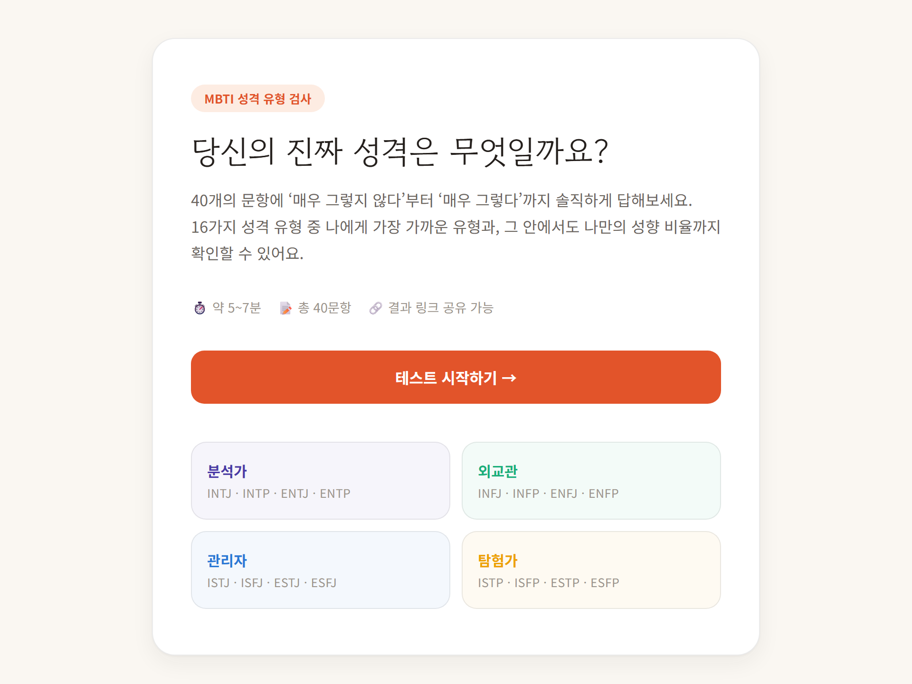
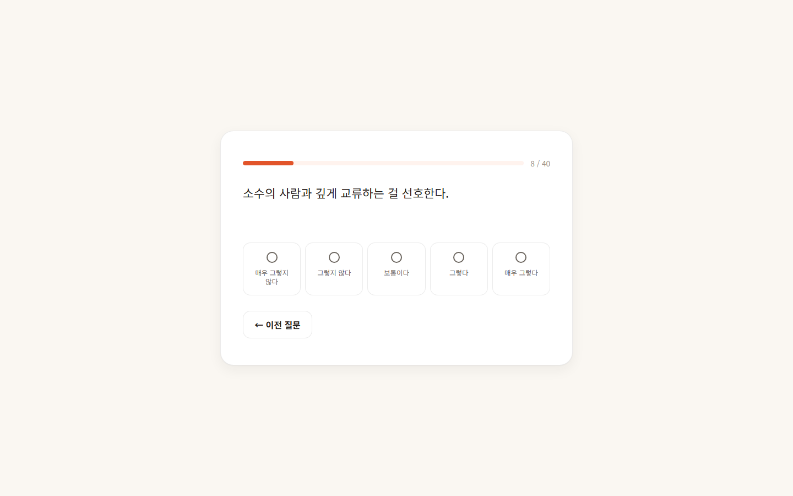
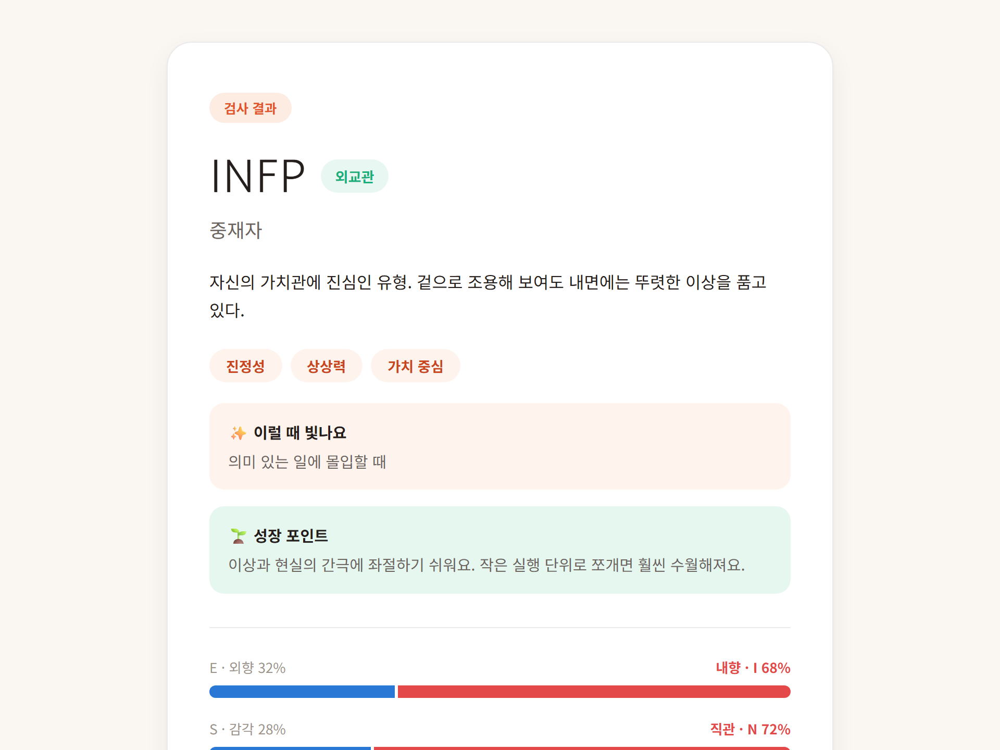
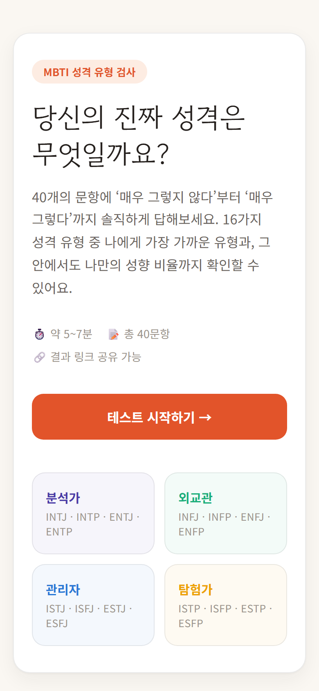
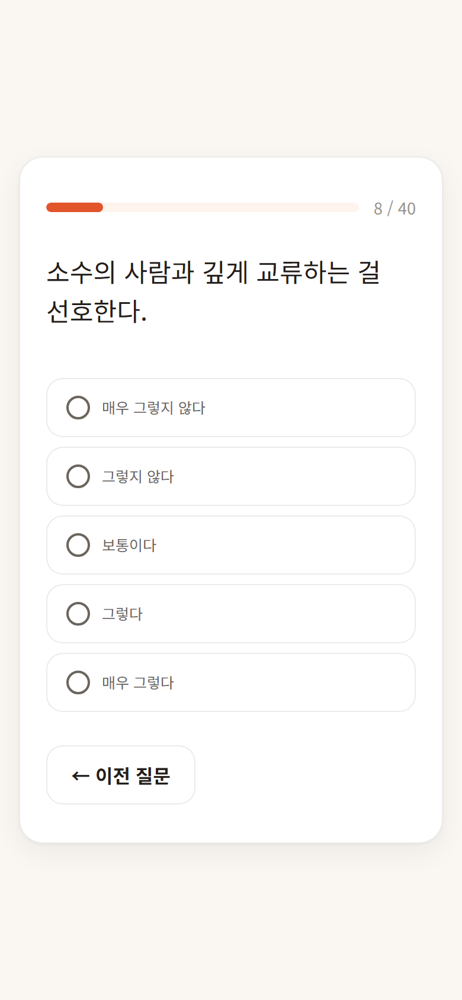
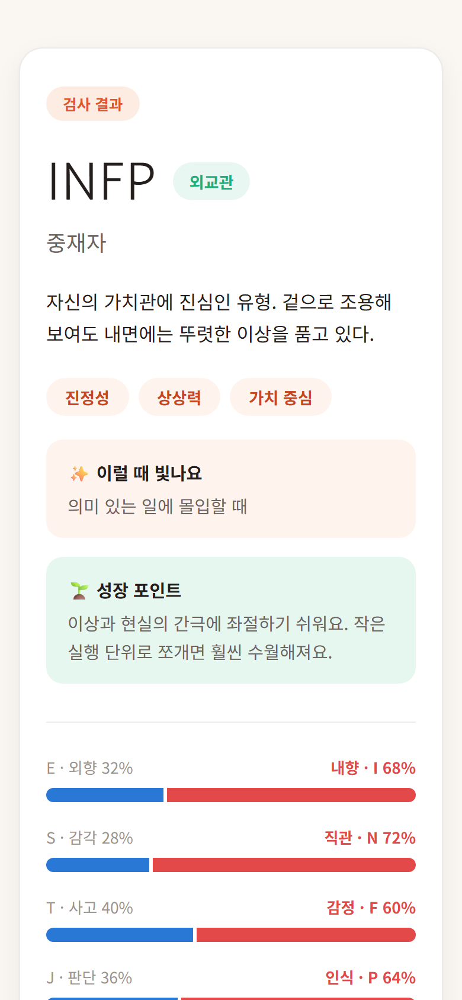

# MBTI 성격 유형 검사

**40문항 5점 척도로 나의 MBTI 유형을 알아보고, 링크 하나로 결과를 공유하는 웹 서비스.** 서버와 DB 없이 결과를 URL에 담아서, 로그인하지 않아도 친구가 똑같은 결과 화면을 볼 수 있습니다.

| | |
|---|---|
| **웹** | **https://mbti-khj.vercel.app** |

기획, 문항 설계, 화면 디자인, 개발, 배포까지 혼자 진행한 프로젝트입니다.



## 주요 기능

- **40문항 5점 척도 검사**: 4개 축(E/I, S/N, T/F, J/P)마다 10문항. "매우 그렇지 않다 ~ 매우 그렇다" 중에서 고름
- **응답 습관에 흔들리지 않는 채점**: 축마다 양쪽 성향 문항을 5개씩 섞어서, 무조건 "그렇다"만 누르는 습관이 결과를 한쪽으로 몰지 않게 함
- **이전 질문으로 돌아가기**: 답을 고치면 진행률 막대에도 바로 반영
- **링크 하나로 결과 공유**: 유형과 축별 퍼센트를 주소에 담아서, 링크만 보내면 받는 사람도 같은 결과를 봄
- **모바일 공유 시트**: "결과 공유하기"를 누르면 카카오톡·인스타그램 등 설치된 앱으로 바로 공유. 공유 기능이 없는 환경(주로 데스크톱)은 링크 복사로 대체
- **유형별 미리보기 카드**: 결과 링크를 메신저에 붙이면 유형 코드·별명·그룹 색이 들어간 카드가 자동으로 보임
- **16유형 상세 결과**: 유형 설명, 강점 태그, "이럴 때 빛나요", 성장 포인트를 유형마다 따로 작성
- **기질 그룹 표시**: 분석가·외교관·관리자·탐험가 4개 그룹을 색 배지로 구분
- **운영 비용 0원**: 외부 API·서버·DB 없이 프론트엔드만으로 동작

## 화면

| 질문 화면 | 결과 화면 |
|---|---|
|  |  |

**모바일**

<table>
  <tr>
    <td></td>
    <td></td>
    <td></td>
  </tr>
</table>

## 동작 구조

```
홈(/) ─→ 검사(/quiz) ─────────────→ 결과(/result?type=INFP&ei=32&sn=28&tf=40&jp=36)
          브라우저에서 40문항 응답        서버가 주소만 읽어서 화면을 그림
          끝나면 채점(scoreAnswers)            │
                                               └─ 링크 미리보기: og:image = /api/og?type=INFP
                                                   (유형별 카드 이미지를 만들어 CDN에 캐시)
```

| 영역 | 기술 |
|---|---|
| Web | Next.js 16 (App Router), React 19, TypeScript |
| 이미지 | `next/og` (링크 미리보기 카드, 파비콘) |
| Test | Vitest, Playwright(화면 흐름 직접 확인) |
| Infra | Vercel (GitHub `main`에 push하면 자동 배포) |

## 핵심 구현과 문제 해결

### 1. "그렇다"만 누르는 습관이 결과를 왜곡하는 문제
- **문제**: 문항을 전부 한쪽 성향으로만 쓰면("사람들과 함께 있을 때 에너지가 채워진다"처럼 E 쪽 진술만), 질문을 잘 읽지 않고 동의만 하는 사람도 E로 나옴. 실제 성향인지 응답 습관인지 구분할 수 없음
- **해결**: 축마다 10문항을 **A 성향 진술 5개 + B 성향 진술 5개**로 나누고, 점수를 합칠 때 진술 방향에 따라 부호를 뒤집음
  ```ts
  const delta = value - 3;                     // 1~5점 → -2~+2
  rawScore += q.pole === poleA ? delta : -delta; // B 성향 진술은 반대로 더함
  ```
- **결과**: 40문항 모두 "매우 그렇다"를 눌러도 각 축에서 +10과 -10이 상쇄되어 **정확히 50:50**. 한쪽으로 쏠린 결과는 실제로 양쪽 진술에 다르게 답했을 때만 나옴
- **처음 버전에서 다시 만든 이유**: 첫 버전은 Vite + React의 28문항 양자택일이었는데, 둘 중 하나를 억지로 고르는 방식이라 "보통이다"를 표현할 수 없고 결과가 단순했음. Next.js로 옮기면서 5점 척도 40문항과 위 채점 방식으로 다시 설계

### 2. 서버 없이 공유되는 결과 링크, 그리고 주소 조작 대비
- **결과를 주소에 담기**: 검사가 끝나면 `/result?type=INFP&ei=32&sn=28&tf=40&jp=36`으로 이동. 결과 페이지는 서버 컴포넌트에서 이 값만 읽어 그리기 때문에, **주소가 곧 결과**. 회원가입·DB 저장 없이 링크 복사 한 번으로 공유 끝
- **주소를 고쳐서 들어와도 깨지지 않게**: 링크는 누구나 손으로 고칠 수 있으므로 값을 검사함
  - 없는 유형(`type=ABCD`) → 404 페이지
  - 숫자가 아닌 퍼센트(`ei=abc`) → 50으로 처리
  - 범위를 벗어난 퍼센트(`ei=150`, `sn=-20`) → 0~100으로 잘라냄
- **검증**: 위 경우를 단위 테스트로 확인하고, Playwright로 공유 링크 새로고침·잘못된 유형 404까지 화면에서 직접 확인

### 3. 한글이 들어간 미리보기 카드를 만들 수 없는 문제
- **문제**: 링크 미리보기 카드를 `next/og`의 `ImageResponse`로 만드는데, 함께 넣을 수 있는 폰트가 **500KB까지**. 한글 폰트(Noto Sans KR)는 수 MB라 통째로 넣을 수 없고, 폰트가 없으면 한글이 깨짐
- **해결**: Google Fonts의 `text=` 옵션으로 **그 카드에 실제로 들어가는 글자만 담은 폰트 조각**을 받아서 그림 (`src/app/api/og/route.tsx`)
- **추가 개선**: 만들어질 수 있는 카드는 16유형 + 기본 카드 = **17장뿐**. 응답에 `Cache-Control: public, max-age=31536000, immutable`을 걸어서, 두 번째 요청부터는 폰트를 다시 받지 않고 CDN이 바로 응답

### 4. 카카오톡으로 공유하면 메시지가 두 개로 쪼개지는 문제
- **처음 시도**: Web Share API로 결과 카드 **이미지 파일 + 문구 + 링크**를 한 번에 공유
- **문제**: 카카오톡 등 일부 앱이 이것을 **사진 메시지와 링크 메시지 두 개로 나눠서** 보냄. 받는 사람 입장에서 지저분함
- **해결**: 이미지 첨부를 빼고, 다음 단계에서 문구도 빼서 **링크 하나만** 공유. 카드 이미지는 결과 페이지의 `og:image`를 통해 받는 앱이 링크 미리보기로 알아서 그려 줌. 공유와 미리보기의 역할을 나눈 것
- **세부 처리**: 사용자가 공유 창을 그냥 닫은 경우(`AbortError`)는 실패로 보지 않고 넘어가고, 그 밖의 오류나 공유 기능이 없는 브라우저에서만 링크 복사로 대체

### 5. 모바일에서 한글 단어가 중간에서 끊기는 문제
- **문제**: Playwright로 모바일 화면을 찍어 보니 "총 40문항"이 `40문 / 항`처럼 **단어 중간에서 줄바꿈**됨
- **원인**: 브라우저는 한글을 기본적으로 글자 단위로 줄바꿈할 수 있다고 보기 때문
- **해결**: 전역에 `word-break: keep-all`을 적용해 띄어쓰기 단위로만 줄바꿈

## 테스트

`npm test`로 채점 로직(`src/lib/scoring.ts`)의 Vitest 단위 테스트 **9개**를 실행합니다.

| 대상 | 확인하는 내용 |
|---|---|
| 채점 (6개) | 모두 "보통이다"면 축마다 정확히 50:50 · 답이 하나도 없어도 50:50 · A 성향으로 완전히 쏠리면 100:0과 ESTJ · B 성향으로 완전히 쏠리면 0:100과 INFP · 축마다 성향 이름이 맞는지 · 한 축만 답했을 때 다른 축은 그대로인지 |
| 공유 링크 복원 (3개) | 퍼센트로 결과를 되살리기 · 빠진 축은 50:50 · 0~100을 벗어난 값은 잘라내기 |

화면 흐름은 Playwright로 직접 확인했습니다: 40문항 끝까지 진행, 이전 질문으로 돌아가도 답 유지, 공유 링크 새로고침, 잘못된 유형 404, 모바일 화면.

## 설계 상세

<details>
<summary><b>채점 방식</b></summary>

- 축마다 10문항, 1~5점 응답을 -2~+2로 바꿔 합산 (B 성향 진술은 부호 반대)
- 합계 범위는 -20 ~ +20, 이것을 A 성향 퍼센트로 변환: `pctA = (합계 + 20) / 40 × 100`
- 답하지 않은 문항은 3점(보통)으로 계산
- **50:50 동점이면 A 성향(E, S, T, J)으로 판정**. 그래서 모든 문항에 "보통이다"를 고르면 ESTJ가 나옴 (테스트로 고정한 동작)

</details>

<details>
<summary><b>결과 주소 형식</b></summary>

| 파라미터 | 뜻 | 예 |
|---|---|---|
| `type` | 유형 코드 (대소문자 상관없음) | `INFP` |
| `ei` | E 성향 퍼센트 (I는 100 - ei) | `32` |
| `sn` | S 성향 퍼센트 | `28` |
| `tf` | T 성향 퍼센트 | `40` |
| `jp` | J 성향 퍼센트 | `36` |

결과 페이지는 이 값으로 화면 제목·설명·미리보기 이미지(`generateMetadata`)까지 유형에 맞게 바꿉니다.

</details>

<details>
<summary><b>기질 그룹</b></summary>

| 그룹 | 조건 | 유형 |
|---|---|---|
| 분석가 | N + T | INTJ, INTP, ENTJ, ENTP |
| 외교관 | N + F | INFJ, INFP, ENFJ, ENFP |
| 관리자 | S + J | ISTJ, ISFJ, ESTJ, ESFJ |
| 탐험가 | S + P | ISTP, ISFP, ESTP, ESFP |

</details>

## 프로젝트 구조

```
mbti-test/
├─ src/app/
│  ├─ page.tsx              홈
│  ├─ quiz/page.tsx         검사 (브라우저에서 응답·채점)
│  ├─ result/page.tsx       결과 (주소의 값만 읽어서 그림, 유형별 메타데이터)
│  └─ api/og/route.tsx      유형별 링크 미리보기 카드
├─ src/components/          5점 척도 버튼, 축 막대, 그룹 배지, 공유 버튼
├─ src/data/
│  ├─ questions.ts          40문항과 각 문항의 성향 방향
│  └─ types.ts              16유형 설명과 기질 그룹
└─ src/lib/
   ├─ scoring.ts            채점과 공유 링크 복원
   └─ __tests__/            채점 단위 테스트
```
